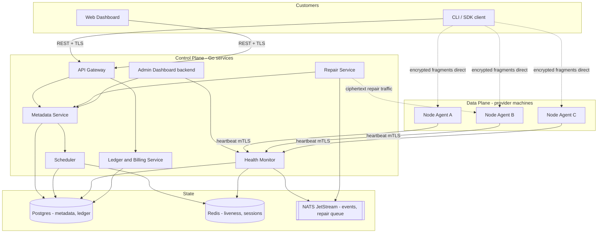
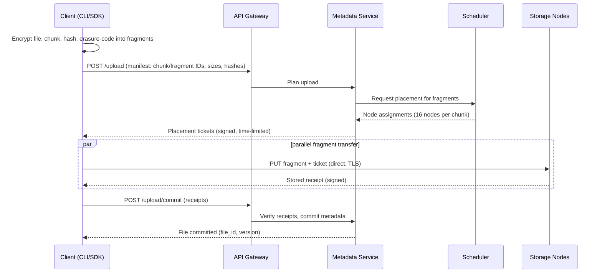
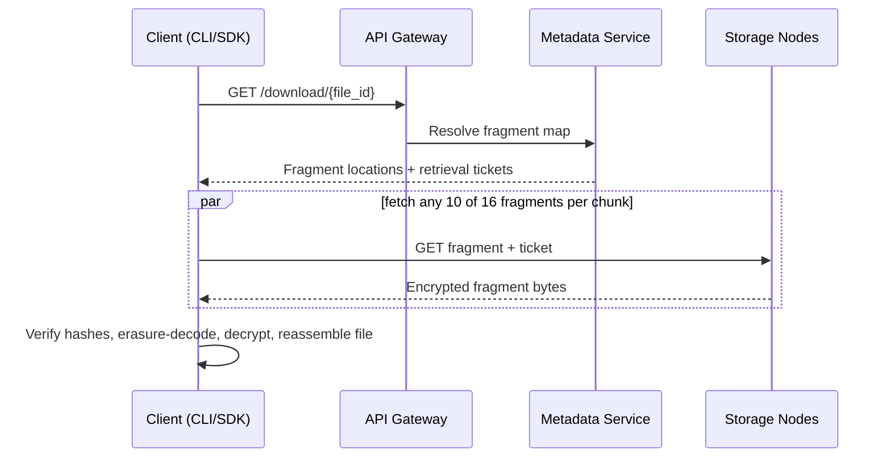
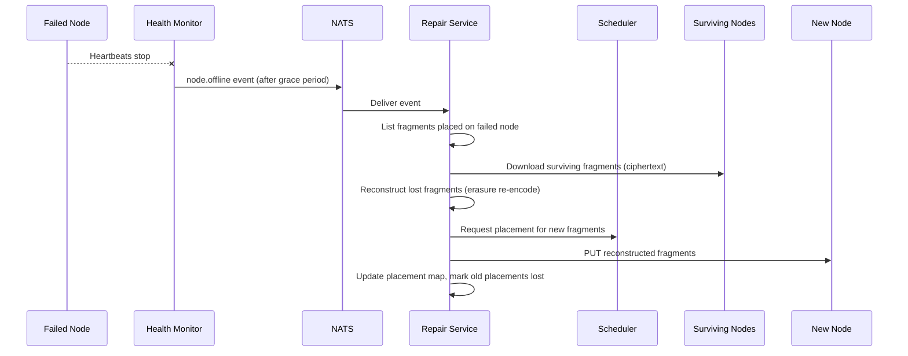

# 02 — System Architecture

The platform is split into a **control plane** (services we run) and a **data plane** (storage nodes run by providers, and clients run by customers). The defining property of the architecture: **file bytes flow only between clients and storage nodes**. The control plane handles metadata, coordination, and health — never file contents.

## Component overview

Solid lines carry metadata and control messages. Dotted lines carry encrypted fragment bytes — note they bypass the control plane entirely.

## Services

### API Gateway

The single public HTTP entry point for customers and the dashboard.

- Terminates TLS, authenticates requests (**API keys** on the solo builder track; JWT access tokens are deferred until after M4), enforces per-account rate limits.
- Routes to internal services. **Solo track (M1):** the gateway talks to metadata over internal HTTP/JSON so the metadata CRUD slice does not block on a protobuf toolchain. gRPC is introduced in M2 with the node control API. Performs request validation and shapes errors into the common format defined in [08-api.md](08-api.md).
- Stateless — scale horizontally behind a load balancer.

### Metadata Service — the "brain"

Owns the source of truth for everything except file bytes: users, buckets, files, versions, chunks, fragments, and fragment placements ([03-data-model.md](03-data-model.md)).

- Serves upload planning: given a file manifest, coordinates with the Scheduler to allocate target nodes and issues signed, time-limited **placement tickets** the client presents to nodes.
- Serves download planning: returns the fragment map (which fragments, on which nodes) plus signed **retrieval tickets**.
- Commits uploads transactionally: a file becomes visible only after enough fragments are confirmed stored.
- All writes go through Postgres with strict transactional boundaries; reads are cache-friendly.

### Scheduler

Decides where every fragment should live. Pure decision-making — it moves no bytes.

- Maintains an in-memory view of candidate nodes (fed from Redis liveness data and Postgres node stats).
- Scores nodes on free capacity, uptime, reputation, latency, geographic and ISP diversity, and historical failures; applies hard placement constraints (e.g., no two fragments of the same chunk on one node/region). Full algorithm in [06-scheduler-and-repair.md](06-scheduler-and-repair.md).
- Also runs continuous **rebalancing**: draining overloaded or degrading nodes, spreading data onto new capacity.

### Health Monitor

The fan-in point for the node fleet.

- Receives heartbeats from every Node Agent (every 10 seconds, over mTLS) and writes liveness state to Redis with a TTL — a node whose key expires is presumed offline.
- Aggregates heartbeat metrics (disk, CPU, RAM, latency, version) into rolling node statistics in Postgres.
- Emits events to NATS when a node transitions state (`online → suspect → offline`), which drives the Repair Service.
- Issues random **storage challenges** to verify nodes actually hold the fragments they claim ([07-security.md](07-security.md)).

### Repair Service

Keeps redundancy at target levels without human intervention.

- Consumes node-failure and audit-failure events from NATS.
- For each affected chunk, checks surviving fragment count against the repair threshold; if below, downloads enough surviving fragments (ciphertext), reconstructs the missing ones via erasure decoding/re-encoding, and places them on fresh nodes chosen by the Scheduler.
- Never decrypts anything — repair operates entirely on encrypted fragments.
- Details and the full self-healing loop: [06-scheduler-and-repair.md](06-scheduler-and-repair.md).

### Ledger / Billing Service

Meters usage and maintains the internal double-entry ledger — computed charges for customers and computed earnings for providers, with **no real money movement** in Phase 1.

- Consumes usage events (bytes stored over time, egress served) from NATS.
- Runs periodic accrual jobs (GB-hour charges, provider earnings weighted by reliability).
- Design in [09-billing-ledger.md](09-billing-ledger.md).

### Admin Dashboard backend

Read-mostly service backing the operator UI: network map, node list with health and reputation, repair queue depth, durability alerts, ledger summaries. Also exposes operator actions (quarantine node, force repair, adjust rates).

## Technology choices and rationale

| Choice | What for | Why |
|---|---|---|
| **Go** | All control-plane services and the Node Agent | One language across the system; excellent concurrency for heartbeat fan-in and parallel fragment transfer; static cross-compiled binaries make the agent trivially distributable to Windows/macOS/Linux providers. |
| **gRPC + protobuf** | Service-to-service and agent-to-control-plane RPC | Typed contracts, streaming support (heartbeats, transfers), efficient on constrained home connections. Public customer API remains REST/JSON for accessibility. |
| **Postgres** | Metadata, node registry, ledger | Transactional integrity is non-negotiable for the placement map and double-entry ledger. Well understood, easy to operate at MVP scale, clear sharding path later. |
| **Redis** | Liveness state, rate limits, sessions, scheduler cache | Heartbeats arrive at fleet scale (100k nodes at 10s interval = 10k writes/s); TTL-based keys give free failure detection without touching Postgres. |
| **NATS JetStream** | Event bus and repair queue | Durable, replayable streams for node-state transitions, usage events, and repair jobs; lightweight to operate compared to Kafka at MVP scale. |
| **klauspost/reedsolomon** | Erasure coding (client and repair service) | Mature, SIMD-accelerated Go implementation. |
| **mTLS with private CA** | Node identity and transport security | Every node gets a certificate at registration; all agent traffic is mutually authenticated. See [07-security.md](07-security.md). |

## Upload sequence (happy path)

Full pipeline detail (encryption, chunking, coding) is in [04-storage-pipeline.md](04-storage-pipeline.md); this shows service interaction.

## Download sequence (happy path)

## Self-healing sequence

## Scalability story: 100 → 1,000,000 nodes

The architecture is the same at every scale; what changes is replication and sharding of the state layer.

**At 100–10,000 nodes (MVP):** single Postgres primary with replicas, single Redis, single NATS cluster, each Go service running 2+ stateless replicas. Nothing more is needed — 10,000 nodes at a 10-second heartbeat is ~1,000 heartbeats/second, comfortably handled by one Health Monitor replica writing to Redis.

**At 100,000+ nodes**, three pressure points emerge, each with a prepared answer:

1. **Heartbeat fan-in.** Health Monitor replicas scale horizontally; nodes are assigned to a replica by consistent hashing on node ID. Liveness stays in Redis (clustered); only aggregated stats and state transitions touch Postgres.
2. **Metadata volume.** The placement map is the largest table (fragments × placements). It shards naturally by `file_id` (customer-facing lookups) — every query in the upload/download path carries a file ID. Node-centric queries (what's on node X, for repair) are served by a maintained inverted index sharded by `node_id`. Both are plain Postgres sharding, no exotic storage needed.
3. **Repair throughput.** Repair workers are stateless NATS consumers; add workers to add throughput. Repair bandwidth is bounded per source node so mass-failure events degrade gracefully instead of stampeding the network.

Two design rules make all of this possible:

- **Stateless services everywhere** — every service can run N replicas; all coordination state lives in Postgres/Redis/NATS.
- **The control plane never touches file bytes** — data-plane bandwidth (the expensive, huge part) scales with the node fleet itself, since clients and nodes exchange fragments directly. Fragment transfer for uploads and downloads costs the platform approximately zero bandwidth. Only repair traffic transits platform infrastructure, and even that can later be delegated to trusted repair nodes at the edge.
