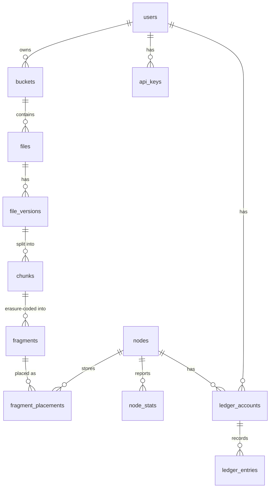

# 03 — Data Model

All control-plane state lives in Postgres. This document defines the Phase 1 schema. Two invariants hold everywhere:

1. **Metadata only.** No table ever contains file contents — not plaintext, not ciphertext. The largest values stored are 32-byte hashes and wrapped (encrypted) key blobs the platform cannot open.
2. **The placement map is transactional truth.** A file exists if and only if its metadata says so and enough placements are confirmed. Every state transition (upload commit, repair, deletion) is a Postgres transaction.

## Entity relationships



## Identity and tenancy

```sql
CREATE TABLE users (
    id              UUID PRIMARY KEY DEFAULT gen_random_uuid(),
    email           TEXT NOT NULL UNIQUE,
    password_hash   TEXT NOT NULL,              -- argon2id
    role            TEXT NOT NULL DEFAULT 'customer',  -- customer | provider | both | admin
    status          TEXT NOT NULL DEFAULT 'active',    -- active | suspended | deleted
    created_at      TIMESTAMPTZ NOT NULL DEFAULT now(),
    updated_at      TIMESTAMPTZ NOT NULL DEFAULT now()
);

CREATE TABLE api_keys (
    id              UUID PRIMARY KEY DEFAULT gen_random_uuid(),
    user_id         UUID NOT NULL REFERENCES users(id),
    key_hash        TEXT NOT NULL,              -- sha256 of the secret; secret shown once
    label           TEXT NOT NULL,
    scopes          TEXT[] NOT NULL DEFAULT '{read,write}',
    expires_at      TIMESTAMPTZ,
    revoked_at      TIMESTAMPTZ,
    created_at      TIMESTAMPTZ NOT NULL DEFAULT now()
);
```

A single account can be a customer, a provider, or both (`role`), so one person can consume storage and contribute it under one identity and one ledger relationship.

## File namespace

```sql
CREATE TABLE buckets (
    id              UUID PRIMARY KEY DEFAULT gen_random_uuid(),
    owner_id        UUID NOT NULL REFERENCES users(id),
    name            TEXT NOT NULL,
    created_at      TIMESTAMPTZ NOT NULL DEFAULT now(),
    UNIQUE (owner_id, name)
);

CREATE TABLE files (
    id              UUID PRIMARY KEY DEFAULT gen_random_uuid(),
    bucket_id       UUID NOT NULL REFERENCES buckets(id),
    path            TEXT NOT NULL,              -- full logical path incl. folders: /photos/2026/img.jpg
    is_folder       BOOLEAN NOT NULL DEFAULT false,
    current_version UUID,                       -- FK to file_versions, set on commit
    status          TEXT NOT NULL DEFAULT 'uploading',  -- uploading | active | deleted
    created_at      TIMESTAMPTZ NOT NULL DEFAULT now(),
    updated_at      TIMESTAMPTZ NOT NULL DEFAULT now(),
    deleted_at      TIMESTAMPTZ,
    UNIQUE (bucket_id, path)                    -- live rows only; see files_bucket_path_live
);

CREATE INDEX files_bucket_prefix ON files (bucket_id, path text_pattern_ops);
```

Folders are lightweight rows (`is_folder = true`); the hierarchy is path-based, so renaming a folder is a prefix update. Deletion is soft (`deleted_at`) followed by asynchronous fragment expiry.

```sql
CREATE TABLE file_versions (
    id              UUID PRIMARY KEY DEFAULT gen_random_uuid(),
    file_id         UUID NOT NULL REFERENCES files(id),
    version_no      INTEGER NOT NULL,
    size_bytes      BIGINT NOT NULL,            -- original plaintext size
    content_sha256  BYTEA NOT NULL,             -- hash of the *encrypted* file, for end-to-end verify
    encryption_meta JSONB NOT NULL,             -- algo, wrapped file key, KDF params (see 07-security.md)
    chunk_size      INTEGER NOT NULL,           -- bytes, e.g. 16777216
    ec_data_shards  SMALLINT NOT NULL DEFAULT 10,
    ec_parity_shards SMALLINT NOT NULL DEFAULT 6,
    status          TEXT NOT NULL DEFAULT 'pending',  -- pending | committed | superseded | expired
    created_at      TIMESTAMPTZ NOT NULL DEFAULT now(),
    committed_at    TIMESTAMPTZ,
    UNIQUE (file_id, version_no)
);
```

`encryption_meta` holds the **wrapped** per-file key — encrypted under the customer's master key, which the platform never sees. Storing it here means a customer can decrypt from any device with only their master key; the platform still cannot ([07-security.md](07-security.md)).

## Chunks, fragments, placements

```sql
CREATE TABLE chunks (
    id              UUID PRIMARY KEY DEFAULT gen_random_uuid(),
    version_id      UUID NOT NULL REFERENCES file_versions(id),
    seq             INTEGER NOT NULL,           -- position within the file
    size_bytes      INTEGER NOT NULL,           -- encrypted chunk size (last chunk may be short)
    sha256          BYTEA NOT NULL,             -- hash of encrypted chunk
    UNIQUE (version_id, seq)
);

CREATE TABLE fragments (
    id              UUID PRIMARY KEY DEFAULT gen_random_uuid(),
    chunk_id        UUID NOT NULL REFERENCES chunks(id),
    shard_index     SMALLINT NOT NULL,          -- 0..9 data, 10..15 parity (default 10+6)
    size_bytes      INTEGER NOT NULL,
    sha256          BYTEA NOT NULL,             -- hash of this fragment; nodes are challenged on it
    UNIQUE (chunk_id, shard_index)
);

CREATE TABLE fragment_placements (
    id              BIGSERIAL PRIMARY KEY,
    fragment_id     UUID NOT NULL REFERENCES fragments(id),
    node_id         UUID NOT NULL REFERENCES nodes(id),
    status          TEXT NOT NULL DEFAULT 'pending',
    -- pending: ticket issued | stored: receipt verified | lost: node failed/audit failed
    -- expiring: scheduled for delete | deleted: node confirmed removal
    stored_at       TIMESTAMPTZ,
    last_audit_at   TIMESTAMPTZ,
    lost_at         TIMESTAMPTZ,
    UNIQUE (fragment_id, node_id)
);

CREATE INDEX placements_by_node ON fragment_placements (node_id, status);
CREATE INDEX placements_by_fragment ON fragment_placements (fragment_id, status);
```

`fragment_placements` is the heart of the system and its largest table. Both access patterns are indexed:

- **by fragment** — download planning and repair-threshold checks ("where does fragment F live, and how many copies are healthy?"),
- **by node** — failure handling ("node N died; which fragments were on it?").

At large scale this table shards by `fragment_id` for the first pattern, with a node-keyed inverted index for the second (see the scalability section of [02-system-architecture.md](02-system-architecture.md)).

## Node registry and health

```sql
CREATE TABLE nodes (
    id              UUID PRIMARY KEY DEFAULT gen_random_uuid(),
    owner_id        UUID NOT NULL REFERENCES users(id),
    cert_fingerprint BYTEA NOT NULL UNIQUE,     -- pins the node's mTLS client certificate
    hostname_label  TEXT,                       -- provider-chosen display name
    os              TEXT NOT NULL,              -- linux | darwin | windows
    agent_version   TEXT NOT NULL,
    country         TEXT,                       -- ISO 3166-1
    region          TEXT,
    asn             INTEGER,                    -- ISP autonomous system, for diversity constraints
    endpoint        TEXT NOT NULL,              -- host:port clients use to reach the node
    capacity_bytes  BIGINT NOT NULL,            -- provider-configured max share
    used_bytes      BIGINT NOT NULL DEFAULT 0,
    status          TEXT NOT NULL DEFAULT 'pending',
    -- pending | online | suspect | offline | draining | quarantined | retired
    reputation      REAL NOT NULL DEFAULT 0.5,  -- 0..1, see 06-scheduler-and-repair.md
    registered_at   TIMESTAMPTZ NOT NULL DEFAULT now(),
    last_seen_at    TIMESTAMPTZ,
    public_key      BYTEA NOT NULL,             -- Ed25519 public key; receipts verified against this
    cert_pem        TEXT NOT NULL,              -- issued leaf (PEM)
    cert_expires_at TIMESTAMPTZ
);

CREATE INDEX nodes_selectable ON nodes (status, reputation DESC) WHERE status = 'online';
```

`public_key` is stored separately from `cert_fingerprint` so upload commit can verify node receipts after the certificate rotates.

One-time agent bind codes (solo track; `POST /nodes/registration-codes` in [08-api.md](08-api.md)):

```sql
CREATE TABLE node_registration_codes (
    id          UUID PRIMARY KEY DEFAULT gen_random_uuid(),
    owner_id    UUID NOT NULL REFERENCES users(id),
    code_hash   TEXT NOT NULL UNIQUE,           -- sha256 of the secret; secret shown once
    endpoint    TEXT NOT NULL,                  -- host:port the node will advertise; clamps cert SANs
    country     TEXT,                           -- ISO 3166-1; declared at mint, copied onto nodes
    region      TEXT,
    asn         INTEGER,                        -- ISP autonomous system, for diversity constraints
    expires_at  TIMESTAMPTZ NOT NULL,
    used_at     TIMESTAMPTZ,
    node_id     UUID REFERENCES nodes(id),
    created_at  TIMESTAMPTZ NOT NULL DEFAULT now()
);
```

Real-time liveness (last heartbeat, seconds-level) lives in **Redis** with TTL keys, not Postgres. Postgres holds durable state transitions and slow-moving attributes.

```sql
CREATE TABLE node_stats (
    node_id         UUID NOT NULL REFERENCES nodes(id),
    window_start    TIMESTAMPTZ NOT NULL,       -- hourly rollup windows
    uptime_ratio    REAL NOT NULL,
    avg_latency_ms  REAL,
    free_bytes      BIGINT,
    cpu_load        REAL,
    mem_used_ratio  REAL,
    audits_passed   INTEGER NOT NULL DEFAULT 0,
    audits_failed   INTEGER NOT NULL DEFAULT 0,
    bytes_served    BIGINT NOT NULL DEFAULT 0,
    bytes_ingested  BIGINT NOT NULL DEFAULT 0,
    PRIMARY KEY (node_id, window_start)
);
```

Hourly rollups feed reputation scoring and provider earnings. Raw heartbeats are not persisted — they are aggregated in memory by the Health Monitor and flushed as rollups.

## Ledger

Double-entry design; full semantics in [09-billing-ledger.md](09-billing-ledger.md).

```sql
CREATE TABLE ledger_accounts (
    id              UUID PRIMARY KEY DEFAULT gen_random_uuid(),
    owner_type      TEXT NOT NULL,              -- user | node | platform
    owner_id        UUID,                       -- NULL for platform accounts
    kind            TEXT NOT NULL,              -- customer_balance | provider_earnings | platform_revenue
    currency        TEXT NOT NULL DEFAULT 'CRD',-- internal credits in Phase 1
    UNIQUE (owner_type, owner_id, kind)
);

CREATE TABLE ledger_entries (
    id              BIGSERIAL PRIMARY KEY,
    txn_id          UUID NOT NULL,              -- groups the two legs of one transaction
    account_id      UUID NOT NULL REFERENCES ledger_accounts(id),
    amount          BIGINT NOT NULL,            -- micro-credits; positive = credit, negative = debit
    entry_type      TEXT NOT NULL,              -- storage_charge | egress_charge | storage_earning | egress_earning | adjustment
    reference       JSONB,                      -- e.g. {"node_id": ..., "window": ...}
    created_at      TIMESTAMPTZ NOT NULL DEFAULT now()
);

CREATE INDEX ledger_by_account ON ledger_entries (account_id, created_at);
-- Invariant enforced by the Ledger service: SUM(amount) over each txn_id = 0.
```

## Audit log

```sql
CREATE TABLE audit_logs (
    id              BIGSERIAL PRIMARY KEY,
    actor_type      TEXT NOT NULL,              -- user | node | service | admin
    actor_id        UUID,
    action          TEXT NOT NULL,              -- e.g. file.upload.commit, node.quarantine, auth.login
    subject_type    TEXT,
    subject_id      UUID,
    detail          JSONB,
    created_at      TIMESTAMPTZ NOT NULL DEFAULT now()
);

CREATE INDEX audit_by_actor ON audit_logs (actor_type, actor_id, created_at);
```

Every security-relevant action — logins, key issuance, node registration, quarantines, deletions, admin operations — is appended here. The table is insert-only; no service holds UPDATE/DELETE grants on it.

## Lifecycle walkthroughs

**Upload commit (single transaction):** insert `file_versions` row as `pending` → insert `chunks` and `fragments` → placements move `pending → stored` as signed node receipts arrive → when every chunk has ≥ threshold stored placements, flip version to `committed` and point `files.current_version` at it. A crash at any point leaves an uncommitted version that a janitor job expires and cleans up on nodes.

**Node failure:** Health Monitor flips `nodes.status` to `offline` → Repair Service marks that node's placements `lost` → for each affected fragment's chunk, if healthy placements < repair threshold, reconstruction is queued → new placements inserted as `pending`, flipped to `stored` on receipt.

**File deletion:** `files.deleted_at` set → placements flip to `expiring` → Node Agents learn of expiry on next sync and delete local fragments → nodes confirm, placements flip to `deleted` → janitor hard-deletes metadata after the retention window.
