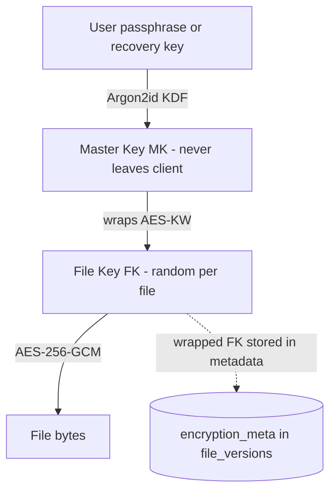
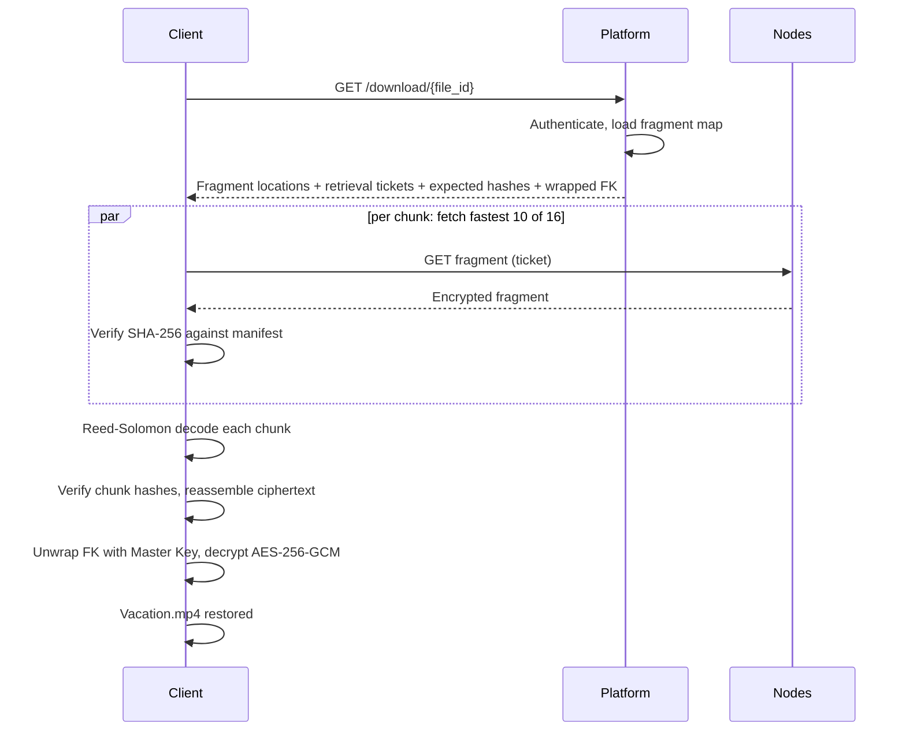

# 04 — Storage Pipeline

This document follows one file — `Vacation.mp4`, 150 MB — through the complete data path: encryption, chunking, hashing, erasure coding, distribution, and back again on download. Everything in the transform pipeline runs **on the client** (CLI/SDK); the control plane only coordinates.

## Pipeline at a glance


## Step 1 — Client-side encryption

Before a single byte leaves the customer's device, the client encrypts the file with **AES-256-GCM** using a fresh, random **per-file key** (the File Key, or FK).

Key hierarchy (envelope encryption):



- The **Master Key (MK)** is derived from the user's passphrase via Argon2id (or generated and stored in the OS keychain, with a printable recovery key). It never leaves the client.
- The **File Key (FK)** is 32 random bytes generated per file version. The file is encrypted with FK using AES-256-GCM in a streaming construction: the file is processed in 64 KiB segments, each sealed with a derived nonce (segment counter) and authentication tag, so multi-GB files encrypt with constant memory and any tampered segment fails authentication on read.
- FK is then **wrapped** (encrypted) under MK and stored in `file_versions.encryption_meta` along with the KDF parameters and algorithm identifiers.

This is why the zero-knowledge guarantee holds structurally, not by policy: the platform stores only the *wrapped* FK. Without MK — which only the customer has — the wrapped blob is useless. The platform could hand its entire database to an attacker and no file would be readable. The trade-off is equally structural: **a customer who loses their passphrase and recovery key loses their data**. There is no reset path, and this is stated in the product terms.

Key management details, algorithm choices, and the threat model are in [07-security.md](07-security.md).

## Step 2 — Chunking

The encrypted stream is split into **fixed-size chunks of 16 MB** (configurable per upload: 8, 16, or 32 MB; 16 MB is the default).

```text
Vacation.mp4 (150 MB) → encrypted → ~150 MB ciphertext
→ chunk 0..8: 16 MB each (144 MB)
→ chunk 9:    ~6 MB (final short chunk)
= 10 chunks
```

Why fixed-size, and why 16 MB:

- **Uniformity** — the scheduler places interchangeable units; nodes account for storage in predictable increments.
- **Parallelism** — 10 chunks × 16 fragments upload concurrently across many nodes and saturate the client's uplink.
- **Home-network friendliness** — a 1.6 MB fragment (16 MB / 10 data shards) transfers in well under a second on typical residential connections, keeping per-transfer failure windows small.
- **Metadata cost** — smaller chunks would multiply rows in the placement map; larger chunks make repairs and retries more expensive.

Files smaller than one chunk are simply a single short chunk — the pipeline is identical.

## Step 3 — Hashing

Each encrypted chunk gets:

| Field | Purpose |
|---|---|
| `chunk_id` (UUID) | Identity in metadata and on nodes |
| `sha256` | Integrity: verified on download and during repair |
| `size_bytes` | Accounting and transfer validation |

A whole-file hash of the ciphertext (`content_sha256`) is also recorded for end-to-end verification after reassembly. All hashes are computed client-side and registered with the Metadata Service in the upload manifest — so a malicious node can never substitute bytes without detection, because the expected hash was fixed before the node ever saw the fragment.

## Step 4 — Erasure coding

Each chunk is expanded with **Reed–Solomon coding** (via `klauspost/reedsolomon`) into **16 fragments: 10 data shards + 6 parity shards** ("10+6"). Any 10 of the 16 fragments reconstruct the chunk exactly.

```text
chunk (16 MB)
→ split into 10 data shards of 1.6 MB
→ compute 6 parity shards of 1.6 MB
= 16 fragments × 1.6 MB = 25.6 MB stored per 16 MB chunk
```

### Why erasure coding beats replication

To survive the loss of any 6 nodes:

| Scheme | Storage overhead | Survives |
|---|---|---|
| 7× full replication | **700%** | loss of any 6 copies |
| Reed–Solomon 10+6 | **160%** | loss of any 6 fragments |

Same failure tolerance at less than a quarter of the cost — decisive when providers are paid per stored gigabyte.

### Durability math

With fragments on 16 independent nodes and (pessimistically) each node having a 10% chance of being unavailable at any moment, a chunk is unreadable only if **7 or more** of its 16 fragments are simultaneously gone:

\[
P(\text{loss}) = \sum_{k=7}^{16} \binom{16}{k} (0.1)^k (0.9)^{16-k} \approx 1.4 \times 10^{-5}
\]

And that is the probability of *temporary* unavailability with **no repair at all**. The Repair Service reconstructs fragments as soon as the healthy count drops to the repair threshold (12 of 16 — see [06-scheduler-and-repair.md](06-scheduler-and-repair.md)), so actual durability is governed by the probability of losing 7 nodes *faster than repairs complete* — driving effective durability to the many-nines range. Placement constraints (distinct nodes, regions, ISPs) keep the independence assumption honest.

## Step 5 — Node selection and distribution

The client sends the upload **manifest** (chunk and fragment IDs, sizes, hashes) to the platform. The Scheduler picks 16 nodes per chunk — scored on capacity, uptime, reputation, latency, and geographic/ISP diversity ([06-scheduler-and-repair.md](06-scheduler-and-repair.md)) — and the Metadata Service returns signed, time-limited **placement tickets**.

The client then uploads fragments **directly to the nodes, in parallel**, presenting a ticket with each PUT. Example placement for one chunk:

```text
fragment 0  → node in Canada        fragment 8  → node in Poland
fragment 1  → node in Germany       fragment 9  → node in South Korea
fragment 2  → node in Japan         fragment 10 → node in Spain
...                                 fragment 15 → node in Australia
```

What a node receives and stores: `fragment_id`, encrypted bytes, expected checksum, expiration. What it never receives: filename, owner, directory, file type, keys, or even which other fragments belong to the same file.

Each node verifies the fragment hash against the ticket, stores the bytes, and returns a **signed receipt**. If a node is unreachable or slow, the client asks for a replacement ticket and retries elsewhere — any healthy node can hold any fragment.

## Step 6 — Metadata commit

The client posts the collected receipts to the platform. The Metadata Service verifies node signatures and commits in one transaction: chunks, fragments, and placements recorded, version flipped to `committed` (see the lifecycle in [03-data-model.md](03-data-model.md)).

A file is reported as successfully uploaded **only when every chunk has at least the commit threshold of 14 of 16 fragments confirmed** — starting above the repair threshold so a freshly uploaded file already has healthy headroom. Missing fragments (up to 2 per chunk) are backfilled by the Repair Service rather than blocking the upload.

## Download path



Per chunk the client needs any 10 fragments, so it races requests to the best-latency nodes and takes the first 10 clean responses — slow or dead nodes cost nothing but a redundant request. Every fragment is hash-verified before decoding; a corrupt fragment is discarded, reported to the platform (which flags the node and its placement), and replaced by fetching one of the remaining 6.

## Integrity verification at every hop

| Hop | Check |
|---|---|
| Client → node (upload) | Node verifies fragment hash from the placement ticket before acknowledging |
| Node at rest | Agent runs background checksum scrubs; Health Monitor issues random challenges ([05-node-agent.md](05-node-agent.md), [07-security.md](07-security.md)) |
| Node → client (download) | Client verifies fragment hash from the manifest |
| After decode | Client verifies chunk SHA-256 |
| After reassembly | Client verifies whole-file `content_sha256` |
| After decryption | AES-GCM authentication tags fail on any tampered segment |

## Failure handling mid-transfer

**Upload:** fragment PUTs are retried with backoff; persistent failure → request replacement ticket for a different node. If the client dies mid-upload, the `pending` version and its orphaned fragments are expired by the janitor job and deleted from nodes. Uploads are resumable: the client re-sends the manifest, and the platform reports which fragments are already confirmed.

**Download:** any fragment failure → try one of the 6 spares; if more than 6 of a chunk's nodes are unreachable (extremely unlikely per the durability math), the client retries with backoff while the platform triggers urgent repair.

**Commit:** receipts are idempotent; re-submitting a commit is safe. The client treats an upload as durable only after the commit response.
