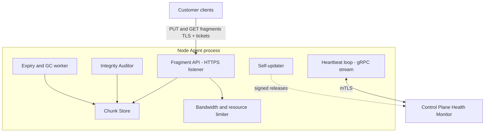

# 05 — Node Agent

The Node Agent is the application storage providers install. It is a single static Go binary that runs as a background service on Windows, macOS, and Linux, turns a configured slice of the provider's disk into rentable capacity, and is the platform's only presence on provider hardware.

Design goals, in order: **do no harm to the host machine** (respect every limit the provider sets), **be verifiably honest** (the control plane can prove the agent holds what it claims), and **be operationally invisible** (no maintenance burden for the provider).

## Internal architecture



## Chunk store: on-disk layout

The agent owns one directory tree, sized by the provider:

```text
<data_dir>/
  identity/
    node.key           # private key (0600), never leaves the machine
    node.crt           # mTLS certificate issued at registration
  fragments/
    ab/cd/abcd0123....frag   # fragment bytes, fanned out by ID prefix
  meta.db              # bbolt: fragment_id -> {size, sha256, expires_at, stored_at, last_verified}
  journal/             # write-ahead intent log for crash safety
```

- Fragments are stored as individual files, fanned out two levels by ID prefix to keep directories small.
- `meta.db` is an embedded bbolt database — the agent's local index. It is authoritative for *what this node holds*; the control plane's placement map is authoritative for *what this node should hold*. A periodic reconciliation sync compares the two and resolves drift (agent deletes unknown/expired fragments; control plane marks missing ones `lost`).
- Writes are crash-safe: fragment bytes are written to a temp file, fsynced, hash-verified, renamed into place, then indexed. A fragment is acknowledged (signed receipt) only after all four steps.

## Provider configuration

Everything the provider controls lives in one file (also editable through the agent's local web UI on `localhost`):

```yaml
# agent.yaml
data_dir: /var/lib/storage-agent
max_storage_gb: 500          # hard cap on platform usage
min_free_disk_gb: 50         # never let the host disk drop below this
max_upload_mbps: 40          # serving fragments to customers
max_download_mbps: 80        # ingesting fragments
active_hours: "00:00-24:00"  # optionally limit heavy transfer windows
bandwidth_metered: false     # if true, agent is conservative with repair traffic
```

Rules of enforcement:

- `min_free_disk_gb` beats everything: if the host fills its disk with its own data, the agent stops accepting fragments and reports reduced capacity in its next heartbeat — it never competes with the owner for space.
- Bandwidth caps are enforced with token-bucket limiters on both directions; outside `active_hours` the agent still serves downloads (availability is part of reputation) but defers ingest and repair traffic.
- Capacity changes take effect immediately: shrinking below current usage puts the node into `draining` — the scheduler migrates fragments away rather than the agent deleting anything unilaterally.

## Heartbeat protocol

The agent holds a long-lived gRPC stream to the Health Monitor over mTLS and sends a heartbeat **every 10 seconds**:

```protobuf
message Heartbeat {
  string  node_id = 1;
  int64   free_bytes = 2;         // within the configured cap
  int64   used_bytes = 3;
  double  cpu_load = 4;
  double  mem_used_ratio = 5;
  uint32  fragment_count = 6;
  string  agent_version = 7;
  double  disk_read_latency_ms = 8;   // rolling p95 from real fragment reads
  optional double disk_temp_c = 9;    // SMART, when available
}
```

Liveness semantics live on the server side ([02-system-architecture.md](02-system-architecture.md)): 3 missed heartbeats → `suspect` (no new placements), 5 minutes silent → `offline` (repair evaluation begins). The stream also carries control messages *to* the agent: expiry lists, audit challenges, drain orders, and update notices — so the agent needs **no open inbound port for control traffic**, only the fragment API port for data.

Nodes that cannot accept inbound connections at all (strict NAT) are out of scope for the MVP; the registration flow tests reachability and rejects unreachable endpoints with guidance (port forwarding/UPnP). Relay traversal is a post-MVP feature.

## Fragment API

The data-plane surface, served over TLS with per-request ticket authorization ([07-security.md](07-security.md)):

| Endpoint | Auth | Behavior |
|---|---|---|
| `PUT /fragments/{id}` | placement ticket | Verify ticket signature and expiry, stream bytes to temp file, verify SHA-256 against ticket, commit, return signed receipt |
| `GET /fragments/{id}` | retrieval ticket | Verify ticket, stream bytes (range requests supported) |
| `DELETE /fragments/{id}` | control-plane signature | Delete and confirm; also driven by expiry lists over the heartbeat stream |
| `GET /challenge` | control-plane signature | Storage-proof response: hash of (nonce ‖ requested byte range) — see below |

The agent accepts a transfer only with a valid ticket, so it never needs to know who customers are — authorization is delegated entirely to the platform's signature.

## Integrity: local scrubs and remote challenges

Two independent mechanisms keep stored data verifiable:

1. **Background scrub (local).** A low-priority worker continuously re-reads stored fragments and re-computes SHA-256, cycling through the full inventory roughly every two weeks (rate-limited to a few MB/s so it never disturbs the host). A mismatch (bit rot, bad sector) causes the agent to delete the fragment and self-report it in the next heartbeat — honest self-reporting is rewarded in reputation versus being caught by an audit.
2. **Random challenges (remote).** The Health Monitor periodically sends a challenge: fragment ID, random byte range, and nonce. The agent must respond with `SHA-256(nonce || bytes[range])` within a deadline. Because the nonce is fresh, the answer cannot be precomputed or cached, and because the range is random, the agent must actually retain the whole fragment. Failed or slow challenges mark the placement `lost` and damage reputation ([06-scheduler-and-repair.md](06-scheduler-and-repair.md)).

## Expiry and garbage collection

Fragments carry an `expires_at` (set from file deletion plus retention, or upload abandonment). The GC worker deletes expired fragments and confirms deletions to the control plane, which flips placements to `deleted`. The reconciliation sync catches anything missed in either direction. Disk space freed by GC becomes available capacity in the next heartbeat.

## Packaging, installation, upgrades

- **Distribution:** single static binary per OS/arch (Windows x64, macOS arm64/x64, Linux x64/arm64) — Go cross-compilation, no runtime dependencies. Installers register it as a service (systemd unit, launchd daemon, Windows service) running as a dedicated low-privilege user with write access only to `data_dir`.
- **First run:** the provider signs in with a registration code from the dashboard; the agent generates a keypair locally, submits a CSR, receives its certificate, runs a reachability and disk benchmark, and goes `online` ([07-security.md](07-security.md) covers the identity ceremony).
- **Upgrades:** the agent checks for signed releases (update channel announced over the heartbeat stream), verifies the release signature against a pinned platform public key, swaps the binary, and restarts itself. Rollout is staged (1% → 10% → 100%) and the control plane can halt a rollout by version. An agent on a version below the supported floor is scheduled for draining rather than cut off abruptly.
- **Uninstall:** deletes the identity and all fragments. The control plane treats it as a normal node loss — heartbeats stop, repair kicks in. No data is ever unrecoverable because of one uninstall, by design.

## Host resource discipline

The agent must be a polite guest: fragment I/O uses low OS I/O priority; scrub and repair traffic are throttled hardest; CPU-heavy work (hashing) is chunked and yielded; memory footprint is bounded (streaming I/O, no full-fragment buffering — target < 150 MB RSS). If the host is under pressure (high CPU load or low memory reported in heartbeats), the scheduler naturally routes new placements elsewhere.
