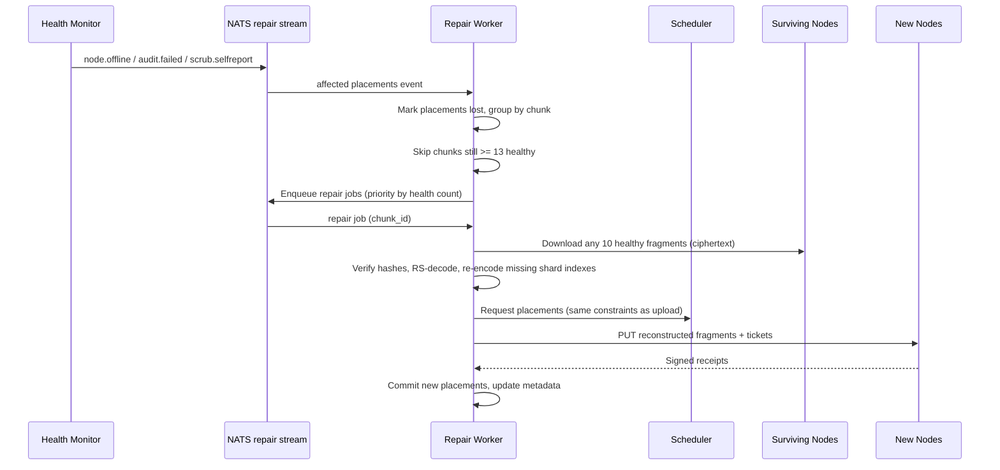

# 06 — Scheduler & Repair

Two subsystems keep data both well-placed and alive: the **Scheduler** decides where fragments go, and the **Repair Service** makes sure they stay recoverable when nodes inevitably fail. Together they implement the platform's promise: *any file, always readable, no human in the loop.*

## Scheduler

### Inputs

The Scheduler keeps a scoring view of every `online` node, refreshed continuously from:

- **Redis** — real-time liveness and last-heartbeat metrics (free space, CPU/memory pressure, latency).
- **Postgres `nodes` / `node_stats`** — durable attributes (country, region, ASN, capacity) and hourly rollups (uptime ratio, audit pass rate, bytes served).

### Node scoring

Each candidate node gets a score in [0, 1]:

```text
score = w_cap  * capacity_headroom     // free share of configured capacity
      + w_up   * uptime_ratio_30d      // rolling 30-day uptime
      + w_rep  * reputation            // see below
      + w_lat  * latency_factor        // normalized RTT from client region
      + w_bw   * bandwidth_factor      // measured throughput percentile
      - penalty_pressure               // current CPU/mem/disk pressure from heartbeats

MVP weights: w_cap 0.20, w_up 0.30, w_rep 0.30, w_lat 0.10, w_bw 0.10
```

**Reputation** is an exponentially weighted moving average over discrete events, so recent behavior dominates but history matters:

| Event | Effect |
|---|---|
| Storage challenge passed | small increase |
| Fragment served successfully | small increase |
| Challenge failed / corrupt fragment served | large decrease |
| Unplanned offline transition | medium decrease |
| Honest self-report of a corrupt fragment | tiny decrease (far cheaper than being caught) |
| Graceful drain before going offline | no penalty |

New nodes start at 0.5 and are capped to a **probation quota** (limited placements) until they accumulate 14 days of history — so an attacker cannot spin up a thousand fresh nodes and immediately attract meaningful data.

### Placement constraints (hard rules, checked before scoring)

For the 16 fragments of any single chunk:

1. **One fragment per node.** Never two fragments of the same chunk on one node.
2. **Region cap:** at most 3 fragments in any one geographic region.
3. **ASN cap:** at most 3 fragments on any one ISP/autonomous system.
4. **Owner cap:** at most 2 fragments on nodes belonging to the same provider account.
5. Node must be `online`, above the free-space floor, and within its probation quota.

These caps keep the failure-independence assumption behind the durability math ([04-storage-pipeline.md](04-storage-pipeline.md)) honest: a regional power outage, an ISP failure, or one provider rage-quitting can each cost at most 3 fragments of any chunk — well inside the 6-fragment tolerance.

**Solo track M3:** the hard caps are live. Selection is uniform-random over the eligible set. Scoring and weighted sampling remain M4. Placement attributes (`country`, `region`, `asn`) are declared by the provider when minting a registration code and copied onto the node at register — the agent cannot self-assert diversity.

### Selection algorithm

For each chunk: filter by hard constraints → **weighted-random sample** 16 nodes with probability proportional to score (not top-16 — deterministic top-k would funnel all new data onto the same best nodes, creating hotspots and correlated risk) → reserve capacity in Redis and issue placement tickets. Reservations expire with the tickets, so abandoned uploads free capacity automatically. **M3** uses uniform random among nodes that pass the hard caps; the weighted sample is M4.

Client-supplied region hints (e.g. "prefer EU") bias `latency_factor` without overriding diversity constraints.

### Rebalancing

A continuous background process, always moving a bounded trickle of data (never a storm):

- **Draining** — provider shrank capacity, scheduled retirement, or version floor: migrate fragments off at a controlled rate, then retire the node.
- **Pressure relief** — nodes persistently above ~85% of configured capacity shed placements to newer capacity.
- **Diversity healing** — constraint drift (e.g. many nodes of one chunk ended up in one region after repairs) is detected by a weekly sweep and corrected opportunistically.
- **New-capacity spreading** — a burst of new nodes gradually receives migrated fragments so the fleet stays evenly loaded.

Rebalancing moves are ordinary repair-pipeline jobs at the lowest priority tier.

## Repair Service

### The fragment-health state machine

Every chunk has 16 placements; what matters is the count of **healthy** ones:


- **≥ 13 healthy:** no action.
- **12 healthy (repair threshold):** normal-priority reconstruction. The 2-fragment buffer above the theoretical minimum-plus-safety exists so repair happens *calmly*, on schedule, not in a panic.
- **≤ 11 healthy:** priority escalates with each further loss; at 10 the chunk is one failure from unreadable and repairs preempt everything.
- **< 10 healthy:** data loss — the event the entire design exists to make (nearly) impossible. Raises an operator alert and a durability incident.

### The self-healing loop



Triggers feeding the loop:

| Trigger | Source | Typical latency to repair |
|---|---|---|
| Node offline 5+ minutes | Health Monitor heartbeat expiry | minutes |
| Failed storage challenge | Health Monitor audits | minutes |
| Corrupt fragment served to a client | client report on download | immediate |
| Agent self-reported scrub failure | heartbeat | minutes |
| Rebalancing move | Scheduler | background, days |

Properties worth noting:

- **Repair never decrypts.** Reed–Solomon reconstruction operates on ciphertext shards; repair workers hold no keys and see no plaintext. The zero-knowledge guarantee survives the repair path.
- **Idempotent and crash-safe.** A repair job re-checks chunk health before acting (the node may have come back — then the job is dropped and placements restored) and commits placements transactionally. A crashed worker's job simply redelivers via NATS.
- **Flap handling.** Home machines reboot and resume. `offline` triggers repair evaluation, but fragments on a returning node are re-validated by challenge and count as healthy again — repair work in flight for them is cancelled. Only fragments actually reconstructed elsewhere cause the returning node's copies to be expired as surplus.

### Repair throughput and mass failure

Workers are stateless NATS consumers — throughput scales by adding workers. Two throttles protect the network:

1. **Per-source-node bandwidth cap** — reconstruction downloads are spread across each chunk's 10+ surviving holders, so no single home connection is saturated by repair reads.
2. **Global repair budget** — an operator-tunable ceiling on total repair bandwidth keeps a mass-failure event (regional outage taking out thousands of nodes) from stampeding the fleet; priority ordering ensures the most at-risk chunks are always repaired first within the budget.

Worked example: a node holding 200 GB dies. That's ~125,000 fragments across ~125,000 distinct chunks (placement spreads them widely). Each chunk needs one fragment (1.6 MB) rebuilt, sourcing 16 MB from ten different nodes. Total repair read traffic ≈ 2 TB spread across tens of thousands of source nodes — a few hundred KB each. No node notices, and at a modest 1 Gbps aggregate repair budget the whole event heals in under 5 hours, while the affected chunks sit at 15/16 healthy — nowhere near danger.
