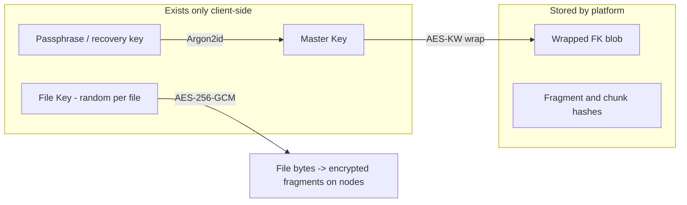

# 07 — Security

The platform's security posture starts from one assumption: **every storage node is hostile**. Node owners can read their disks, sniff their network, modify the agent binary, lie about what they store, and collude with each other. Security must hold *anyway* — by construction, not by policy.

## Threat model

| Adversary | Capabilities | Primary defenses |
|---|---|---|
| **Malicious storage provider** | Reads/copies fragment bytes, deletes fragments, serves corrupted data, claims to store data it discarded, runs many Sybil nodes | Client-side encryption (bytes are useless), fragment hashes fixed before placement, storage challenges, probation and owner-diversity caps, reputation |
| **Network attacker** | Intercepts, replays, or tampers with traffic between clients, nodes, and platform | TLS 1.3 everywhere, mTLS for node traffic, signed single-use tickets, nonces in challenges |
| **Malicious customer** | Abuses API, probes other tenants' data, uploads garbage manifests | Per-account authz on every metadata object, signed tickets scoped to specific fragments, rate limits, quota enforcement |
| **Compromised platform** (worst case: full database + infrastructure breach) | Reads all metadata, wrapped keys, placement map; can serve wrong fragment maps | Zero-knowledge design: no decryptable customer data, no unwrapped keys exist server-side; client verifies all hashes independently, so even a lying platform cannot forge file contents |
| **Insider / operator** | Same as compromised platform, plus admin actions | Same structural limits, plus append-only audit log and least-privilege service credentials |

What the design does **not** defend against (stated honestly): a compromised *customer device* (malware that steals the master key), traffic-analysis metadata inference at global-observer scale, and platform-level denial of service (the platform can refuse to serve fragment maps — availability, unlike confidentiality, does require trusting the platform to be online).

## Key management and zero knowledge

The full key hierarchy is described in [04-storage-pipeline.md](04-storage-pipeline.md); the security-relevant properties:



- **Argon2id** (memory-hard) derives the Master Key from the passphrase, making offline brute-force of a stolen wrapped-key blob expensive even for weak passphrases. Parameters (memory, iterations, salt) are stored in `encryption_meta` per file version so they can be strengthened over time.
- **Per-file keys** bound blast radius: compromising one FK (e.g., a shared file, later) exposes one file, not an account.
- **Key rotation:** the passphrase can change without re-encrypting data — re-wrap all FKs under the new MK (a metadata-sized operation). Rotating an FK requires re-encrypting that file, exposed as an explicit operation.
- **Recovery:** at account creation the client generates a high-entropy recovery key that also wraps MK. Lose both passphrase and recovery key → data is unrecoverable, by design. The platform cannot reset it because the platform has nothing to reset.

**Zero knowledge in concrete terms** — a node operator inspecting their disk sees: fragment IDs (random UUIDs), high-entropy ciphertext, sizes, and expirations. They cannot determine filenames, owners, file types, file boundaries (fragments from one file are scattered and unlinkable without the placement map), or even whether two fragments belong to the same customer.

## Identity and authentication

Three principal types, three mechanisms:

### Customers
- Password login (argon2id-hashed) → short-lived **JWT access token** (15 min) + rotating refresh token. TOTP 2FA supported at launch.
- **API keys** for programmatic access: random 256-bit secrets, shown once, stored hashed, scoped (`read`/`write`) and expirable ([03-data-model.md](03-data-model.md)).
- Every metadata object is owner-checked on every request — object IDs are UUIDs but are *not* relied on as secrets.

### Nodes
- At registration the agent generates a keypair locally and submits a CSR bound to a one-time registration code from the provider's dashboard. The platform CA issues a certificate with the node UUID as its subject; the fingerprint is pinned in the `nodes` table.
- All node ↔ platform traffic is **mTLS** against the private CA — a node *is* its certificate. Certificates are short-lived (30 days) and renewed automatically over the authenticated channel; revocation is enforced by fingerprint check against the registry on every connection, so a stolen certificate dies with a database flag rather than waiting on CRL propagation.
- The private key never leaves the node. Cloning a node's identity onto a second machine is detectable (concurrent heartbeat streams from different addresses) and results in quarantine.

### Services
- Internal gRPC uses mutual TLS with per-service certificates and least-privilege database roles (e.g., nothing but the Ledger service can write `ledger_entries`; nothing at all can update `audit_logs`).

## Tickets: capability-based data-plane authorization

Storage nodes never see customer identity, yet must authorize every transfer. The mechanism is signed, single-purpose **tickets** (Ed25519, platform-signed), issued by the Metadata Service during upload/download planning:

```json
{
  "op": "put",                      // put | get
  "fragment_id": "…",
  "node_id": "…",                   // ticket is useless at any other node
  "sha256": "…",                    // for put: hash the node must verify
  "max_bytes": 1677722,
  "expires_at": "2026-07-25T21:10:00Z",   // minutes-scale lifetime
  "nonce": "…",                     // single-use; node rejects replays within expiry window
  "sig": "ed25519:…"
}
```

The node checks the signature against the pinned platform public key, the node ID, expiry, and nonce — and needs nothing else. Properties: a leaked ticket is nearly worthless (minutes-lived, single fragment, single node, single direction); nodes make zero authorization calls to the platform (the data plane stays fast and the control plane stays out of the byte path); and for uploads the expected hash rides in the ticket, so a node can never be tricked into storing bytes that don't match what the customer registered.

Node **receipts** are the mirror image: the node signs `(fragment_id, sha256, size, stored_at)` with its certificate key. The Metadata Service verifies receipts at commit time — so a client cannot claim placements that never happened, and a node cannot later deny having accepted a fragment.

## Tamper detection

Layered, as summarized in [04-storage-pipeline.md](04-storage-pipeline.md):

1. **Fragment SHA-256** — fixed in the manifest *before* any node sees bytes; verified by the node on ingest (against the ticket) and by the client on retrieval (against the manifest). A node cannot substitute content undetected.
2. **Chunk SHA-256** — verified after erasure decode, catching any decode-level inconsistency.
3. **Whole-file ciphertext hash** — verified after reassembly.
4. **AES-GCM authentication tags** — the cryptographic backstop: even if every hash check were somehow bypassed, tampered ciphertext fails authenticated decryption. Corrupted data can never silently decrypt into wrong plaintext.

Any client-side verification failure is reported to the platform, which marks the placement `lost`, penalizes the node's reputation, and queues repair.

## Storage proofs: random challenge audits

Hashes prove integrity *of what a node serves* — challenges prove a node still *holds* data it isn't currently serving. The Health Monitor continuously audits the fleet:

```text
challenge  = { fragment_id, offset, length, nonce }        // random range, fresh nonce
response   = SHA-256( nonce || fragment_bytes[offset : offset+length] )
platform   verifies against fragment content it knows the hash-tree of… 
```

For the MVP, verification uses **pre-computed challenge sets**: at upload commit, the client (or repair worker, for reconstructed fragments) computes responses for N future random ranges per fragment and registers them with the platform. The platform spends them one at a time. When a fragment's challenge set runs low, the Health Monitor refreshes it by fetching the fragment once (as a normal ticketed GET, verifying its hash) and computing a new set — keeping audits cheap in the steady state without the platform storing fragment bytes.

Audit scheduling: every fragment is challenged on a randomized interval averaging a few days, weighted toward low-reputation and recently-flapped nodes. The nonce prevents precomputation; the random range forces retention of the full fragment; the deadline (seconds) prevents a node from fetching the fragment from a colluding peer just-in-time. Post-MVP, this upgrades to Merkle-proof-based challenges with unlimited verifications per fragment.

## Transport security

- **TLS 1.3 only**, everywhere. No plaintext listener exists anywhere in the system.
- Customer ↔ platform: TLS + JWT/API key.
- Node ↔ platform: mTLS (private CA), certificate-pinned both ways.
- Client ↔ node: TLS (node's platform-issued certificate, so clients verify they're talking to a registered node) + ticket authorization. Fragment bytes are already AES-256-GCM ciphertext — TLS here protects tickets and traffic metadata, not confidentiality of the payload.
- Repair worker ↔ node: mTLS + tickets, same as clients.

## Audit logging and operational security

- Every security-relevant event — logins, token/key issuance, node registration and quarantine, ticket batch issuance, deletions, admin actions — is appended to the insert-only `audit_logs` table ([03-data-model.md](03-data-model.md)); no service credential can modify or delete entries.
- Admin actions require an admin-role account with mandatory 2FA and are individually attributed.
- Secrets hygiene: platform signing keys and the CA key live in a KMS/HSM in production deployments; service credentials are short-lived and injected at runtime, never in images or repositories.
- Abuse limits: per-account rate limits and quotas at the gateway; upload manifests are validated for structural sanity (fragment counts, sizes, shard indexes) before any tickets are issued.
