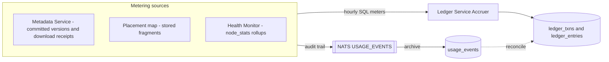

# 09 — Billing & Ledger

Phase 1 billing is an **internal ledger**: the platform meters real usage, computes real charges and earnings, and maintains auditable balances — but **no actual money moves**. Credits accumulate; settlement (Stripe charges, provider payouts) is a later phase that plugs into this ledger without changing it. This lets the MVP validate the economics (are the meters right? do provider incentives work?) before touching payment rails.

## Unit of account

Internal credit **CRD**, stored as integer micro-credits (1 CRD = 1,000,000 µCRD) — integer math only, no floating-point money. A notional peg (e.g. 1 CRD ≈ $0.01) is a display concern, configurable, and irrelevant to ledger correctness.

## What gets metered



| Meter | Source | Used for |
|---|---|---|
| **GB-hours stored** (customer) | Metadata Service — committed version sizes over time | Storage charge |
| **Egress bytes** (customer) | Node-signed GET receipts reported by the client (`POST /download/{id}/report`) | Download bandwidth charge |
| **GB-hours held** (node) | Placement map: `stored` placements × fragment size × time | Storage earning |
| **Egress bytes served** (node) | Node-signed transfer logs, cross-checked against client download reports | Traffic earning |
| **Uptime & audit results** (node) | Health Monitor hourly rollups (`node_stats`) | Reliability multiplier |

Upload (ingest) bandwidth is free in Phase 1 — it flows client→node and costs the platform nothing; charging for it is a future policy decision, not a design constraint.

Billing is **meter-sourced**: the hourly Accruer reads Postgres meters (committed version sizes, `stored` placements × fragment size, `download_receipts`, `node_stats`) and posts balanced transactions. Sources also emit `USAGE_EVENTS` onto a durable NATS stream. The Ledger Service archives those events into `usage_events` as a replayable audit trail and reconciles egress event bytes against `download_receipts`. Events carry deterministic IDs (`usage:{kind}:{subject}:{window}` plus a receipt nonce for egress), so replay after a crash cannot double-archive.

The Accruer is idempotent per `(kind, subject, window)` via a `ledger_txns` primary key. A watermark records the last accrued hour; on restart the Accruer backfills missed windows (bounded catch-up) and retries after errors instead of exiting.

## Double-entry ledger

Every economic fact is one transaction (`txn_id`) with entries summing to zero across accounts ([03-data-model.md](03-data-model.md) has the schema). Three account kinds exist per participant, plus platform accounts:

```text
Hourly storage accrual for customer C (450 GB stored for 1 h @ ≈4109 µCRD/GB-h):
  txn 8a1f…:
    customer_balance(C)      -1_849_315 µCRD   // 450 * 3_000_000 / 730
    platform_revenue         +1_849_315 µCRD

Hourly storage earning for node N (120 GB held, R = 0.97):
  txn 3c9d…:
    platform_revenue         -239_178 µCRD     // 120 * 1_500_000 / 730 * 0.97
    provider_earnings(N->owner) +239_178 µCRD
```

Invariants, enforced by the Ledger Service (sole writer to ledger tables):

- `SUM(amount) = 0` per `txn_id` — checked in Go before commit and by a deferred Postgres trigger.
- `ledger_txns.txn_id` is the uniqueness key; a concurrent or replayed `PostTxn` is a no-op (`ON CONFLICT DO NOTHING`).
- Entries are immutable; corrections are new `adjustment` transactions (`PostAdjustment`, reason required in `reference`), never edits.
- Balances are derived (`SUM` per account) — the entries are the truth. Display endpoints compute the sum; a materialized running balance is not required.
- Every entry's `reference` JSON links back to its cause (window, node, file, event ID) for full auditability.

## Customer pricing (Phase 1 defaults, config-driven)

| Item | Rate |
|---|---|
| Storage | 3.0 CRD per GB-month, accrued hourly (3_000_000 / 730 ≈ 4109 µCRD per GB-hour) |
| Download egress | 1.0 CRD per GB |
| Upload | free |
| Redundancy | standard 10+6 included; premium redundancy (e.g. 10+10) at a storage multiplier — post-MVP |
| API requests | free in Phase 1 (rate-limited); metering hooks exist for later |

Charged storage is the customer's **logical bytes** (file sizes), not the ~1.6× erasure-coded physical footprint — the redundancy overhead is the platform's cost of goods, covered by the margin between customer and provider rates.

## Provider earnings

Earnings per node accrue hourly:

```text
storage_earning  = GB_held_avg  * storage_rate * R(node)
egress_earning   = GB_served    * egress_rate  * R(node)
```

with Phase 1 rates `storage_rate = 1.5 CRD/GB-month equivalent`, `egress_rate = 0.5 CRD/GB`, and **R**, the reliability multiplier, derived from the same rolling metrics the scheduler uses ([06-scheduler-and-repair.md](06-scheduler-and-repair.md)):

```text
reputation_factor = 0.8 + 0.4 * reputation     // reputation is the [0, 1] EWMA; factor is [0.8, 1.2]
R = uptime_ratio_30d * audit_pass_rate_30d * reputation_factor      // clamped to [0, 1.2]
```

`R` is applied as integer basis points (`R * 10000`). A node at reputation 1.0 with full uptime and clean audits has `reputation_factor` 1.2 and earns the premium.

Behavior this produces, by construction:

- A node at 99.9% uptime with clean audits and a long consistent history (reputation → 1) earns a premium (`R` above 1, capped at 1.2).
- Flaky nodes earn proportionally less *and* receive fewer placements from the scheduler — earnings and placement pressure push in the same direction.
- A failed storage challenge zeroes the affected placement's accrual from the moment of failure (the data wasn't really there) in addition to its reputation damage.
- Fragments lost by the node stop accruing immediately (`stored` → `lost` placements leave the meter).

Anti-gaming notes: egress earnings are paid only for **ticketed** transfers reconciled between node-signed logs and client reports — a provider downloading their own hosted fragments through a colluding account pays customer egress rates that exceed provider egress earnings, making self-dealing a net loss. Storage earnings accrue only for placements the *scheduler* created; a node cannot stuff itself with junk data.

## Billing cycle

- **Accrual:** hourly jobs post storage and egress from Postgres meters (logical committed bytes, `stored` placements, `download_receipts`, `node_stats`). The Accruer keeps a watermark and backfills missed hours after a crash. `USAGE_EVENTS` is archived continuously as the audit trail and reconciled against receipts. Everything is visible in near-real-time via `GET /storage` (customers) and `GET /earnings` (providers, broken down by node, window, and type) ([08-api.md](08-api.md)). Amounts are integer µCRD. Reliability `R` is applied as integer basis points.
- **Monthly statement:** On cycle close, a statement job snapshots per-account totals into an immutable statement record.
- **Quotas:** Customers have a configurable credit floor (`LEDGER_CREDIT_FLOOR_UCRD`, default 0). At the floor, uploads are blocked (`403 quota_exceeded`) while downloads and deletions remain available.

## What settlement will add later (explicitly out of scope now)

The ledger is designed so that Phase 2 settlement only *adds* transaction types, never restructures:

- `deposit` transactions (Stripe payment → customer_balance credit),
- `payout` transactions (provider_earnings debit → external transfer record),
- tax/invoice metadata on statements,
- fraud holds as ordinary reversible `adjustment` transactions.

Nothing in the metering, accrual, or account structure changes when real money arrives — that is the point of doing double-entry from day one.
