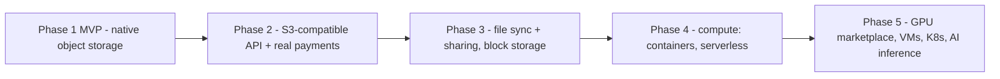

# 10 — MVP Roadmap

The build order follows one rule: **every milestone ends with something that runs end-to-end**, even if the slice is thin. Redundancy, healing, and billing layer onto a working store-and-retrieve core rather than being built in parallel and integrated late.

## Proposed repository layout (monorepo)

```text
distributed-storage-platform/
  docs/                    # this documentation set
  proto/                   # protobuf definitions (control API, tickets, receipts)
  cmd/
    gateway/  metadata/  scheduler/  healthmon/  repair/  ledger/  admind/
    agent/                 # node agent binary
    dsp/                   # customer CLI
  internal/
    pipeline/              # encryption, chunking, erasure coding (shared by CLI and repair)
    tickets/  receipts/  ca/   # crypto primitives
    store/                 # postgres + redis access layers
  web/
    dashboard/             # customer + provider dashboard (SPA)
    admin/                 # operator dashboard
  deploy/
    compose/               # local dev + simulated fleet
    migrations/
```

## Milestones

### M0 — Foundations (week 1–2)
Monorepo scaffolding, CI, protobuf toolchain, Postgres migrations from [03-data-model.md](03-data-model.md), Docker Compose dev environment (Postgres, Redis, NATS), private CA utility.
**Exit:** `docker compose up` brings up empty control-plane skeletons that pass health checks.

### M1 — Metadata service + auth (week 3–4)
Users, buckets, files, folders, rename, soft delete; JWT + API keys; API Gateway with error format and rate limits from [08-api.md](08-api.md).
**Exit:** full metadata CRUD via the CLI against a running gateway — no bytes stored yet.

### M2 — Node agent + happy-path storage (week 5–7)
Agent with chunk store, registration ceremony (CA, mTLS), heartbeats to Redis liveness; fragment PUT/GET with tickets and receipts; naive scheduler (random online nodes, hard constraints only); CLI pipeline **without** erasure coding (single-copy fragments) to keep the slice thin.
**Exit:** `dsp put Vacation.mp4 && dsp get Vacation.mp4` round-trips through 5 local agent containers, byte-identical.

### M3 — Client-side encryption + erasure coding (week 8–9)
Full pipeline from [04-storage-pipeline.md](04-storage-pipeline.md): Argon2id key derivation, AES-256-GCM streaming encryption, wrapped file keys, Reed–Solomon 10+6, plan/transfer/commit protocol with resume, hash verification at every hop.
**Exit:** round-trip succeeds with any 6 of 16 agents stopped; plaintext never observable on any node's disk (asserted by test).

### M4 — Health, repair, self-healing (week 10–12)
Health Monitor state machine (`online → suspect → offline`), NATS events, Repair Service with priority queue, ciphertext reconstruction, flap handling; storage challenges with pre-computed challenge sets; scheduler upgraded to full scoring + weighted sampling ([06-scheduler-and-repair.md](06-scheduler-and-repair.md)).
**Exit:** kill 6 of 16 agents holding a file; within minutes all chunks are back to 16/16 healthy on survivors + fresh nodes, download works throughout. This milestone is the platform's core claim — it gets the most test investment.

### M5 — Ledger + billing (week 13–14)
Usage event stream, double-entry ledger, hourly accruals, reliability multiplier, `GET /storage` and `GET /earnings`, quota enforcement ([09-billing-ledger.md](09-billing-ledger.md)).
**Exit:** a simulated month (accelerated clock) produces balanced books — every txn sums to zero, customer charges reconcile with provider earnings + platform margin.

### M6 — Dashboards + MVP hardening (week 15–17)
Customer dashboard (files, usage), provider dashboard (nodes, earnings, registration codes), admin dashboard (network map, repair queue, quarantine actions); audit logging wired through; agent installers + self-update for the three OSes; load and chaos test pass (below).
**Exit:** the full MVP scope of [01-overview.md](01-overview.md), demoable end-to-end by a non-developer through the dashboards.

Timeline assumes a small focused team (2–4 engineers); treat weeks as relative sizing.

## Testing strategy

### Simulated fleet (the primary tool)

Docker Compose (and later a k8s profile) runs the control plane plus **N agent containers** (50–200 on one dev machine — the agent is a small static binary). A fleet-controller test harness manipulates the fleet programmatically:

```text
harness verbs:
  kill <n> nodes           # abrupt loss (SIGKILL)
  drain <node>             # graceful retirement
  partition <nodes>        # iptables-based network cuts
  corrupt <node> <frac>    # flip bytes in stored fragments
  throttle <node> <mbps>   # degrade bandwidth
  flap <node> <period>     # reboot loops
  clock-skew, disk-full, slow-disk (via tc/cgroups)
```

### Test layers

| Layer | What | Examples |
|---|---|---|
| Unit | Pure logic | erasure code round-trips, ticket signing/expiry, scoring function, ledger invariants (property-based: entries always sum to zero) |
| Integration | Service pairs against real Postgres/Redis/NATS | upload commit transactionality, heartbeat expiry → state transition, challenge verify |
| End-to-end | CLI against full compose stack | put/get/delete/rename/list; resume after interrupt; wrong-passphrase fails cleanly |
| **Chaos** | Harness scenarios against the fleet | the M4 exit test; corrupt-fragment detection → repair; regional partition (all "EU" nodes cut) → availability maintained; mass failure repair within budget |
| Durability soak | Long-running (days) randomized kill/flap/corrupt schedule against thousands of files | zero chunks ever below 10 healthy; measured repair latency distribution |
| Security | Adversarial | node serving tampered bytes is caught and penalized; replayed/expired/cross-node tickets rejected; platform DB dump decrypts nothing (red-team fixture) |

### Continuously measured invariants (CI + soak)

1. Every committed chunk has ≥ 12 healthy placements (alert < 13).
2. No plaintext or unwrapped key ever appears in any node's `data_dir` or any control-plane store.
3. Ledger: every transaction sums to zero; meters reconcile with the placement map.
4. Placement constraints (node/region/ASN/owner caps) hold for every chunk after any sequence of repairs.

## Long-term evolution

Each phase reuses the previous one's infrastructure — the storage network is the foundation, not a detour:



- **Phase 2:** S3 gateway ([08-api.md](08-api.md)), Stripe deposits and provider payouts on the existing ledger ([09-billing-ledger.md](09-billing-ledger.md)), open provider enrollment, NAT relay traversal for agents, Merkle-based storage proofs.
- **Phase 3:** folder-sync client on the same pipeline; sharing via re-wrapped file keys; block-storage volumes (fixed-size chunk maps over the same fragment substrate); provider-set pricing marketplace.
- **Phase 4:** the node agent grows a sandboxed execution runtime (containers first); the scheduler generalizes from placing fragments to placing workloads — same scoring, reputation, and challenge machinery.
- **Phase 5:** GPU capacity as a first-class resource class, VM hosting on high-tier nodes, distributed K8s node pools, AI inference serving — community-powered cloud infrastructure with enterprise-grade reliability, built on the trust, reputation, and payment rails proven by storage.
