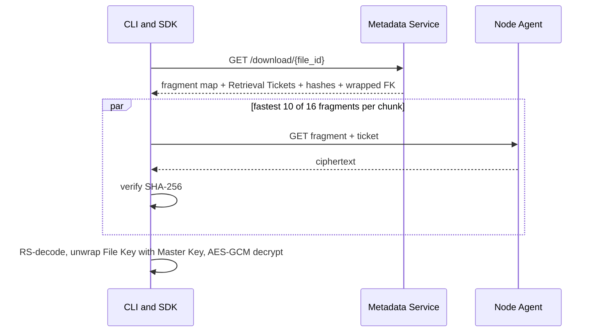

---
tags:
  - flow
aliases:
  - Download
  - GET file
---

# Download Flow

Slow or dead nodes cost a redundant request, not a failure. A corrupt fragment is discarded, reported (placement `lost`, [[Reputation]] hit, [[Repair Loop]]), and replaced from the remaining 6.

If more than 6 of a chunk's nodes are unreachable, the client retries while the platform triggers urgent repair — extremely unlikely given [[Erasure Coding]] durability math plus [[Placement Constraints]].

Related: [[Retrieval Ticket]], [[Zero Knowledge]], [[Customer REST API]]
