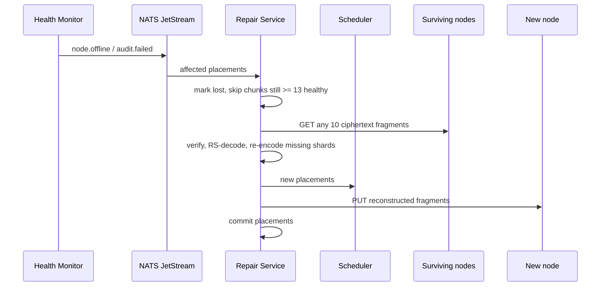

---
tags:
  - flow
aliases:
  - Self-healing loop
  - Reconstruction
---

# Repair Loop

Triggered by: [[Node]] offline 5+ min, failed [[Storage Challenge]], corrupt fragment on download, agent scrub self-report, or low-priority rebalance from [[Scheduler]].

## Properties

- **Ciphertext only** — [[Zero Knowledge]] holds
- **Idempotent** — re-check health before acting (node may have flapped back); NATS redelivers crashed jobs
- **Flap handling** — returning node's fragments are re-challenged; in-flight repair for them is cancelled; only actually reconstructed copies expire the old ones as surplus

See [[Repair Service]], [[Self-Healing]], [[Erasure Coding]]
