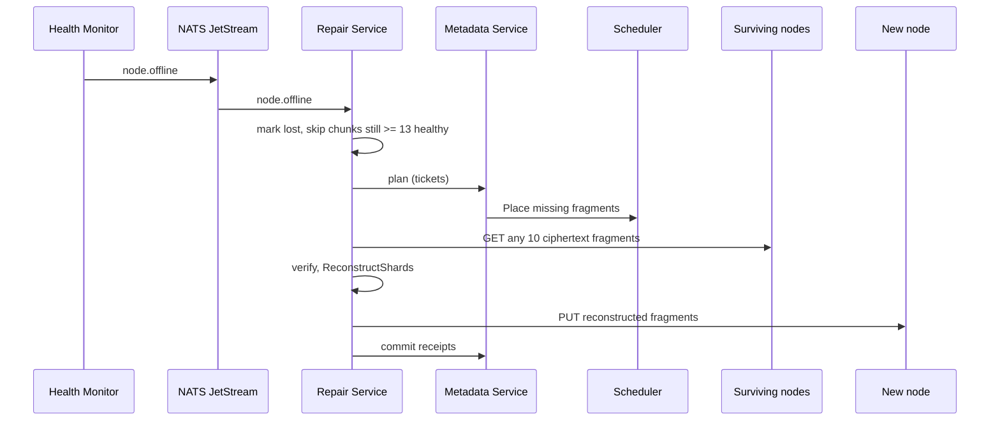

---
tags:
  - flow
aliases:
  - Self-healing loop
  - Reconstruction
---

# Repair Loop

Triggered by: [[Node]] offline 5+ min. Failed [[Storage Challenge]], corrupt fragment on download, and scrub self-report are specified but not yet wired (follow-up M4 slice).

## Properties

- **Ciphertext only** — [[Zero Knowledge]] holds; worker has no signing seed
- **Idempotent** — re-check health before acting (node may have flapped back); NATS redelivers crashed jobs
- **Flap handling** — returning node's fragments are hash-GET re-validated (interim, until [[Storage Challenge]]); only actually reconstructed copies expire the old ones as surplus

See [[Repair Service]], [[Self-Healing]], [[Erasure Coding]]
