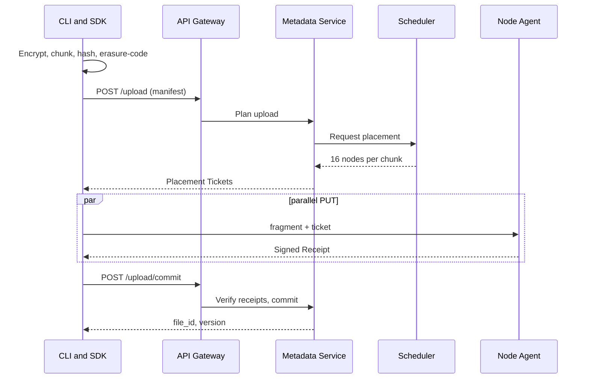

---
tags:
  - flow
aliases:
  - Upload
  - PUT file
---

# Upload Flow

Happy path. Transform work is on [[CLI and SDK]]; [[Control Plane]] only plans and commits.

## Thresholds

A file is reported uploaded only when every [[Chunk]] has **≥ 14 of 16** [[Fragment Placement]]s `stored`. Missing fragments (up to 2) are backfilled by [[Repair Service]] rather than blocking the client.

## Failures

Unreachable node → replacement ticket. Client crash → `pending` [[File Version]] expired by janitor. Uploads are **resumable** via re-POST of the same manifest.

Related: [[Map of Storage Pipeline]], [[Placement Ticket]], [[Erasure Coding]], [[Customer REST API]]
