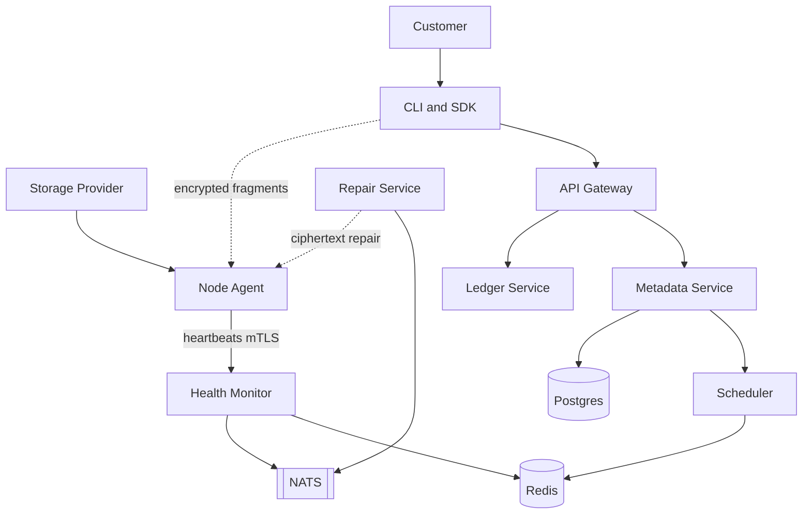

---
tags:
  - map
aliases:
  - Start here
  - Knowledge base
  - Index
---

# Distributed Storage Platform

A decentralized cloud storage network. Unused disk on ordinary computers becomes a secure, globally distributed cloud. The platform orchestrates; it never stores file contents and can never decrypt them.

**Status:** Phase 1 — solo builder track. Specs in `docs/` are canonical. Code is starting at M0 (foundations). The vault is the **graph of how those pieces connect**. Active scope is M0–M4 (durability demo); ledger and dashboards are deferred. See [[Map of Roadmap]].

## Open the graph

1. You opened the `knowledge-base/` folder as a vault (see [[How to open]])
2. Open **[[System Canvas]]** for a hand-laid architecture map
3. Then **Graph view** (`Cmd+G` / `Ctrl+G`) for the full web of notes
4. Nodes are colored by type (legend below). Click a node, then use **Backlinks** in the right sidebar.

| Color | Meaning | Tag |
|---|---|---|
| Teal | Maps of content | `#map` |
| Red | Who participates | `#participant` |
| Blue | Control-plane services | `#service` |
| Green | Database entities | `#entity` |
| Orange | Runtime flows | `#flow` |
| Purple | Security concepts | `#security` |
| Gold | Money / credits | `#billing` |
| Gray | Technology choices | `#tech` |
| Navy | Build plan | `#roadmap` |

## How the system is shaped

Solid lines = metadata and control. Dotted lines = encrypted fragment bytes. Bytes **never** enter the [[Control Plane]].

## Maps of content

Start here, then drill into atomic notes. Each map is a hub; the graph grows from these.

- [[Map of Architecture]] — control plane vs data plane, every service
- [[Map of Data Model]] — users → buckets → files → chunks → fragments → nodes
- [[Map of Storage Pipeline]] — encrypt → chunk → hash → erasure-code → place
- [[Map of Security]] — zero knowledge, keys, tickets, proofs
- [[Map of Billing]] — meters, double-entry ledger, earnings
- [[Map of Roadmap]] — MVP milestones and what comes after

## The three participants

| Who | What they do | What they never see |
|---|---|---|
| [[Customer]] | Upload / download through [[CLI and SDK]] or [[Web Dashboard]] | Which [[Node]] holds their data |
| [[Storage Provider]] | Runs a [[Node Agent]], earns [[Provider Earnings]] | Filenames, owners, plaintext |
| [[Control Plane]] | Auth, metadata, placement, repair, billing | File contents, [[Master Key]] |

## Core promises

- [[Zero Knowledge]] — [[Client-side Encryption]] with [[AES-256-GCM]] before a byte leaves the device
- [[Erasure Coding]] — Reed–Solomon 10+6; any 10 of 16 [[Fragment]]s rebuild a [[Chunk]]
- [[Self-Healing]] — missed [[Heartbeat Protocol]] and failed [[Storage Challenge]]s trigger the [[Repair Loop]]
- [[Horizontal Scalability]] — same architecture from 100 to 1,000,000 nodes

## Fastest path through the vault

1. [[Upload Flow]] — what happens to a file
2. [[Map of Architecture]] — who does it
3. [[Repair Loop]] — how it stays alive
4. [[Zero Knowledge]] — why neither nodes nor the platform can read data

## Source documents

Long-form design (the engineering specs this vault is derived from):

| Spec | Vault map |
|---|---|
| `docs/01-overview.md` | this note, [[MVP Scope]] |
| `docs/02-system-architecture.md` | [[Map of Architecture]] |
| `docs/03-data-model.md` | [[Map of Data Model]] |
| `docs/04-storage-pipeline.md` | [[Map of Storage Pipeline]] |
| `docs/05-node-agent.md` | [[Node Agent]] |
| `docs/06-scheduler-and-repair.md` | [[Scheduler]], [[Repair Service]] |
| `docs/07-security.md` | [[Map of Security]] |
| `docs/08-api.md` | [[Customer REST API]] |
| `docs/09-billing-ledger.md` | [[Map of Billing]] |
| `docs/10-mvp-roadmap.md` | [[Map of Roadmap]] |
