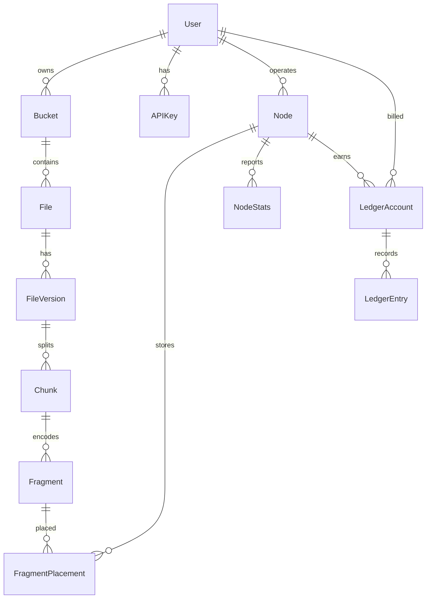

---
tags:
  - map
aliases:
  - Schema
  - Data model
---

# Map of Data Model

All control-plane state lives in [[Postgres]]. Two invariants:

1. **Metadata only.** No table contains file contents — not plaintext, not ciphertext. Largest values are 32-byte hashes and wrapped key blobs the platform cannot open.
2. **The [[Fragment Placement]] map is transactional truth.** A [[File]] exists if and only if metadata says so and enough placements are confirmed.

## Entity graph

## Identity

- [[User]] — one account can be customer, provider, both, or admin
- [[API Key]] — hashed secrets for programmatic access
- [[Node]] — provider machine; identity is its mTLS certificate fingerprint

## File namespace

- [[Bucket]] — per-owner unique name
- [[File]] — path-based hierarchy; folders are lightweight rows
- [[File Version]] — holds `encryption_meta` (wrapped [[File Key]]), hashes, EC params

## Storage substrate

- [[Chunk]] — encrypted 16 MB slice of a version
- [[Fragment]] — one Reed–Solomon shard (data or parity)
- [[Fragment Placement]] — which [[Node]] holds which fragment, and in what status

This last table is the heart of the system and the largest. Indexed **by fragment** (download / repair threshold) and **by node** (failure handling).

## Health and money

- [[Node Stats]] — hourly rollups; feeds [[Reputation]] and [[Provider Earnings]]
- [[Ledger Account]] / [[Ledger Entry]] — double-entry; see [[Map of Billing]]
- [[Audit Log]] — insert-only security event trail

## Lifecycles that mutate this model

- [[Upload Flow]] — pending version → stored placements → committed
- [[Download Flow]] — read-only; uses healthy placements
- [[Repair Loop]] — `stored` → `lost` → new pending placements
- [[File Deletion]] — soft delete → expiring → deleted → janitor
