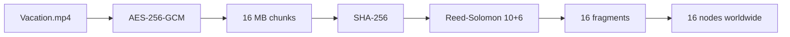

---
tags:
  - map
aliases:
  - Storage pipeline
  - Pipeline
---

# Map of Storage Pipeline

Everything in the transform pipeline runs **on the client** ([[CLI and SDK]]). The [[Control Plane]] only coordinates.

## One file, end to end

| Step | Note |
|---|---|
| 1. Encrypt | [[Client-side Encryption]] with a fresh [[File Key]], wrapped under [[Master Key]] |
| 2. Chunk | Encrypted stream → 16 MB [[Chunk]]s |
| 3. Hash | Per-chunk and per-fragment SHA-256, registered *before* any node sees bytes |
| 4. Code | [[Erasure Coding]] via [[Reed-Solomon]] → 16 [[Fragment]]s |
| 5. Place | [[Scheduler]] picks nodes; [[Placement Ticket]]s authorize PUTs |
| 6. Commit | [[Signed Receipt]]s → [[Metadata Service]] commits in one transaction |

Worked example: 150 MB file → ~10 chunks → 160 fragments of ~1.6 MB. Physical stored size ≈ 160% of ciphertext ([[Erasure Coding]] vs 7× replication).

## Return path

[[Download Flow]]: fetch any 10 of 16 fragments per chunk → verify hashes → decode → unwrap FK with MK → [[AES-256-GCM]] decrypt.

## Integrity at every hop

Upload node check → at-rest [[Storage Challenge]] / local scrub → download client check → chunk hash → whole-file `content_sha256` → GCM tags.

Related: [[Upload Flow]], [[Zero Knowledge]], [[Placement Constraints]], [[Self-Healing]]
