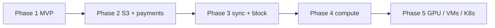

---
tags:
  - roadmap
aliases:
  - Phases
  - Future
  - Vision
---

# Long-term Vision

Storage is the foundation, not the destination. Each phase reuses the previous infrastructure — [[Reputation]], [[Scheduler]], ledger, [[Node Agent]].

- **Phase 2:** S3 gateway on [[Customer REST API]], Stripe `deposit` / provider `payout` on existing [[Ledger Account]]s, open enrollment, NAT relay, Merkle [[Storage Challenge]]s
- **Phase 3:** folder-sync client; sharing via re-wrapped [[File Key]]s; block volumes on the same fragment substrate; provider-set pricing marketplace
- **Phase 4:** sandboxed execution on the agent; scheduler generalizes from placing fragments to placing workloads
- **Phase 5:** GPU resource class, VMs, distributed K8s, AI inference — community-powered cloud on rails proven by storage

See [[MVP Scope]] for what ships first, [[Non-goals]] for what waits.
