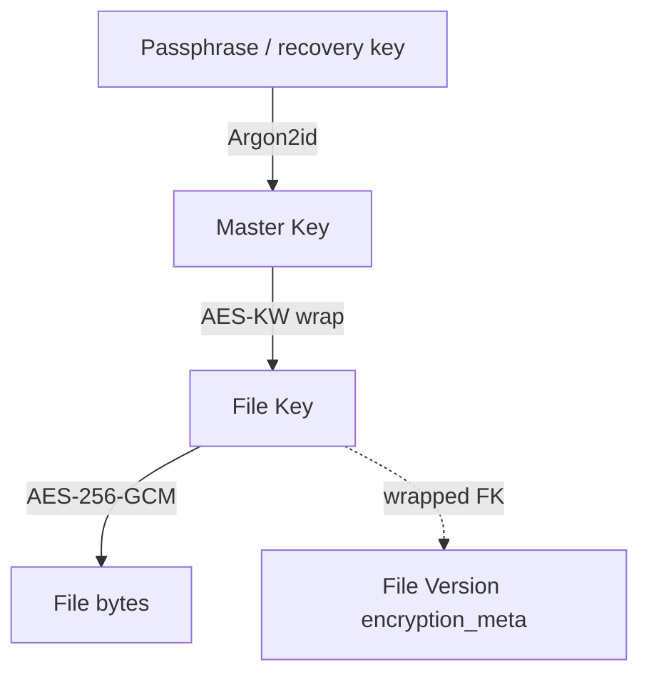

---
tags:
  - security
aliases:
  - Envelope encryption
  - Encryption
---

# Client-side Encryption

Runs in [[CLI and SDK]] **before a single byte leaves the device**.

- [[Master Key]] never leaves the client
- [[File Key]] is 32 random bytes per [[File Version]]
- Streaming [[AES-256-GCM]]: 64 KiB segments, nonce from segment counter, auth tag per segment — constant memory, tampered segment fails on read
- Wrapped FK stored by [[Metadata Service]] so any of the customer's devices can decrypt; platform still cannot

Passphrase change = re-wrap all FKs (metadata-sized). FK rotation = re-encrypt that file.

Related: [[Zero Knowledge]], [[Map of Storage Pipeline]]
